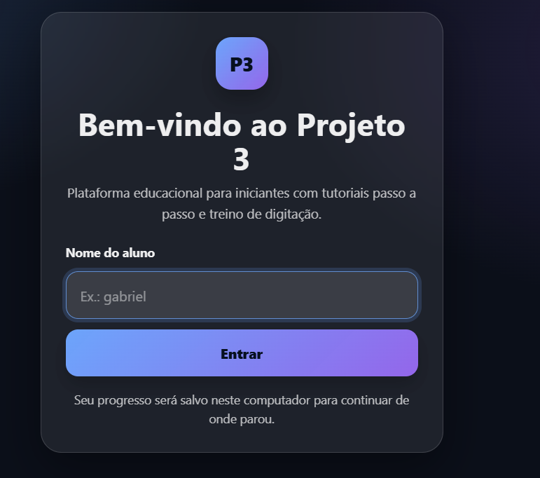
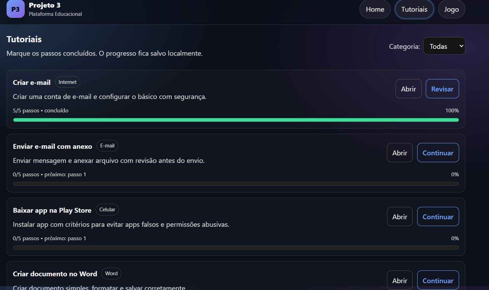
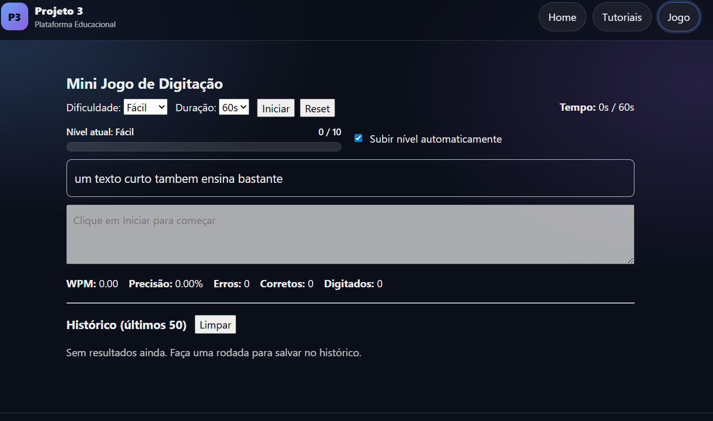

# Projeto 3 — Plataforma Educacional para Iniciantes

Aplicação web educacional criada para ajudar iniciantes a aprender habilidades digitais básicas através de **tutoriais passo a passo** e **treino de digitação interativo**.

O objetivo é oferecer uma experiência simples e acessível para pessoas que estão começando a usar computadores ou smartphones.

---

## Interface

### Tela de Login

### Tela inicial

### Tutoriais

### Jogo de digitação

## Visão geral

A plataforma permite que um aluno:

- acompanhar seu progresso em tutoriais básicos
- treinar digitação com feedback em tempo real
- evoluir de nível automaticamente
- salvar progresso localmente

Todo o progresso é salvo no navegador utilizando **localStorage**, permitindo continuar de onde parou.

---

## Funcionalidades

### Sistema de aluno

- identificação simples por nome
- troca rápida de aluno
- progresso individual salvo localmente

### Tutoriais educacionais

Tutoriais divididos por categorias:

- Internet
- E-mail
- Celular
- Word

Cada tutorial possui:

- passos sequenciais
- marcação de progresso
- barra de conclusão

### Mini jogo de digitação

Treinador de digitação com:

- níveis de dificuldade
- duração configurável
- cálculo de WPM (palavras por minuto)
- precisão
- contagem de erros
- histórico das últimas sessões

---

## Tecnologias utilizadas

- React
- TypeScript
- Vite
- React Router
- CSS

---

## Estrutura do projeto

src
app
routes
features
typing
tutorials
lib

Organização baseada em **features**, separando lógica do jogo, rotas e tutoriais.

---

## Execução do projeto

Clone o repositório:

git clone https://github.com/GabrielSantos-1/projeto3-educacao.git

Instale dependências:

npm install

Execute em modo desenvolvimento:

npm run dev

A aplicação estará disponível em:

http://localhost:5173

---

## Status do projeto

Versão atual: **MVP funcional**

Inclui:

- sistema de aluno
- tutoriais com progresso
- mini jogo de digitação
- armazenamento local

---

## Roadmap futuro

Possíveis evoluções do projeto:

- autenticação real com backend
- sincronização de progresso em banco de dados
- ranking de digitação
- dashboard para professores
- novos módulos educacionais
- deploy público da aplicação

---

## Objetivo do projeto

Este projeto faz parte de um conjunto de aplicações desenvolvidas para estudo de:

- desenvolvimento front-end
- arquitetura de aplicações React
- experiência do usuário para iniciantes em tecnologia

---

## Autor

Gabriel Santos  
GitHub:  
https://github.com/GabrielSantos-1
